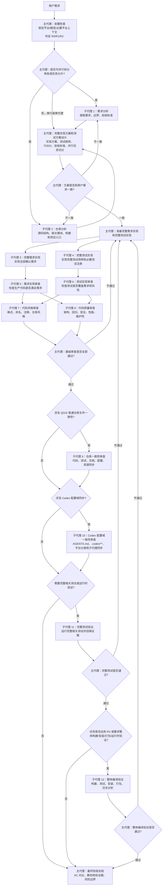

## 1. 基础约束

### 1.1 通用注意事项

- 在仓库级指令范围内，以当前仓库根目录 `AGENTS.md` 文件内容作为本仓库最高优先级项目指令。
- 可调用脚本：
  - 当前平台分册声明额外外部根路径且路径已核验时，可调用这些外部根路径中的 `*.sh`、`*.bat`、`*.pl`、`*.bash`、`*.cmd`、`*.ps1` 及模型自定义脚本获取实际结果。
  - 可调用当前仓库目录中的 `*.sh`、`*.bat`、`*.pl`、`*.bash`、`*.cmd`、`*.ps1` 以及模型自定义临时脚本获取实际结果。
  - 可调用 `__QGISCompilationNavigation__` 目录中的脚本获取实际结果。
- 允许创建临时文件/目录用于复现与验证，验证完成后必须清理，不得残留。
- 文档中的账号、密码、提取码、代理地址等历史示例一律视为敏感/过期信息，仅用于背景理解，不可复用或扩散。
- 仓库包含跨平台内容，即 Windows/Linux/macOS + AMD64/ARM64 组合，回答前必须先锁定目标平台基础信息。版本、工具链和构建/运行配置方案等额外上下文仅在当前任务依赖时再锁定。
- 遇到不确定结论时，必须回到源码、脚本或官方文档二次核验，不能仅凭经验回答。
- 对会写入仓库目录的脚本，执行前必须声明影响范围，执行后必须清理新增产物。

### 1.2 占位符注意事项

- `__QGISCompilationNavigation__` 表示仓库外本地资料根目录，必须记录绝对路径、取值来源和 `Test-Path` 结果。文档中的具体盘符或路径示例仅用于说明格式，不得当作默认值或固定配置。
- 占位符真实值可来自用户在本轮或可追溯上下文中明确提供/确认的信息，也可来自按 `1.4 上下文发现` 生成并整理给用户审查的脚本输出。用户明确修正脚本输出时，以用户修正值为准。
- 用户提供或修正 `__QGISCompilationNavigation__` 时，必须执行存在性核验。若当前平台分册声明了其它必需外部根路径，也必须按分册说明核验其真实值、来源和 `Test-Path` 结果。
- 在 `__QGISCompilationNavigation__` 及当前任务所需外部根路径均解析成功且 `Test-Path=True` 前，不得执行依赖这些外部路径的命令。任一路径校验失败时，必须停止并报告缺失项。
- 平台分册必须声明其特有外部根路径的占位符名称、来源配置、字段路径、核验方式和不适用条件。顶层文件不固定任何单个平台的外部根路径占位符。
- 不得使用平台分册示例、脚本隐式行为、示例配置方案、示例路径或历史上下文来补齐用户未明确提供/确认的配置。
- 当上下文已得到占位符真实值且有效时，后续引用路径必须自动替换并拼接到真实目录。

### 1.3 平台分册选择规则

- 当前仓库根目录中的 AGENTS.md 是顶层通用规则，而 .codex/AgentsDocs/*.md 是平台配置分册，只能补充具体平台的资料入口、脚本入口、验证边界和阻塞条件，不能覆盖本文件的安全、权限、任务等级和验收规则。
- 回答、分析、实现、测试或构建前，必须先锁定基础平台信息，至少包含当前宿主或用户指定目标平台的操作系统信息和指令集架构信息。缺少平台信息或 `__QGISCompilationNavigation__` 时，必须先按 `1.4 上下文发现` 获取或要求用户补充。
- 锁定平台后必须读取对应分册，并把分册路径作为本轮证据来源之一：
  - Windows 10/11 + x86-64：`.codex/AgentsDocs/QGIS-Windows-AMD64.md`
  - Windows 10/11 + ARM64：`.codex/AgentsDocs/QGIS-Windows-ARM64.md`
  - Linux + AMD64：`.codex/AgentsDocs/QGIS-Linux-AMD64.md`
  - Linux + ARM64：`.codex/AgentsDocs/QGIS-Linux-ARM64.md`
  - macOS + ARM64：`.codex/AgentsDocs/QGIS-macOS-ARM64.md`
- QGIS 版本、Qt 版本、工具链、构建/运行配置方案、平台配置文件、依赖根、发行版、glibc、部署目标、用户指定脚本目录等不属于所有任务都必须由用户预先提供的基础上下文。只有当当前任务涉及编译、测试、安装、打包、插件调试、运行时验证，或平台分册明确声明某个动作依赖这些配置时，才必须按当前平台分册继续核验并在缺失时询问用户。不得用平台分册示例、脚本隐式行为或历史资料替代用户选择。
- 若平台分册不存在、与用户目标不匹配，或分册明确说明当前平台缺少构建/测试入口，则不得套用其它平台命令。必须报告阻塞项、已核验证据和需要补充的资料。
- 涉及编译、测试、安装、打包、插件调试或运行时验证时，必须优先使用当前平台分册列出的资料和脚本入口。顶层 AGENTS.md 不固定任何单个平台的构建入口脚本、配置文件、构建/运行配置方案、发行版、依赖根或工具链路径。
- 子代理任务包必须包含已选平台分册路径、基础平台信息、占位符真实值与 `Test-Path` 结果、任务等级、允许读写范围和期望输出。若任务依赖 `QGIS/Qt/工具链/构建/运行配置方案/平台配置文件/依赖根/发行版/glibc/部署目标` 等额外平台上下文，也必须一并提供其来源和核验结果。

### 1.4 上下文发现

- 当本轮上下文尚未锁定平台信息或 `__QGISCompilationNavigation__` 时，必须先读取 `.codex\HelperScripts\README.md`，并按该 README 中当前平台、使用场景、执行时间注意事项和完整命令运行对应入口脚本。
- HelperScripts 必须生成可审查的 UTF-8 JSON 证据。主代理必须把 `PlatformInfo` 与 `Placeholders.__QGISCompilationNavigation__` 整理给用户审查修正。
- 入口脚本名称、参数、配置文件、输出字段、状态含义、候选路径处理和完整命令均以 `.codex\HelperScripts\README.md` 及脚本实际行为为准，顶层 AGENTS.md 不重复维护这些细节。
- 若 README 或脚本输出表明发现失败、候选歧义、缺少必需字段，或用户修正后的路径核验失败，必须报告阻塞项，不得继续执行依赖平台或外部路径的命令。
- HelperScripts 只负责上下文发现与 JSON 证据输出，不替代平台分册中的构建、测试、安装、发布或插件调试入口。

### 1.5 文件权限注意事项

- 对当前仓库内所有文件具备读取、执行、修改、创建权限。除临时创建文件/目录外，对文件进行删除操作之前必须明确提示。
- 对当前仓库外路径仅允许读取、执行，不允许进行删除、修改、创建等写入操作，除非本文件另有明确例外。
- 仓库外写入唯一例外：仅可在已确认有效的 `__QGISCompilationNavigation__`、当前平台分册声明的必需外部根路径及其编译输出目录下创建/修改/删除临时产物（如日志、缓存、中间文件）用于验证。执行前必须声明影响范围，验证完成后必须清理。

### 1.6 文件编码注意事项

- 所有文本文件按 UTF-8 字符集编码读取使用。
- 在使用具体宿主环境读取文本文件时，必须显式采用 UTF-8 或先核验编码。
- 如果读取的内容出现乱码，应该先做字符集编码核验，然后再继续分析。

## 2. 任务判级

### 2.1 判级总则

- 回归等级按“当前任务的实际意图、实际操作类型、文件影响面和验证目标”综合判定，且三者互斥：
  - R0：只读静态分析
  - R1：仅改说明/解释性文档
  - R2：改源码/构建链/测试链/运行发布链文件或者任务本身要求构建、测试、安装、打包、运行时验证结论
- 同一任务中若同时出现多种操作，按最高等级执行（`R2 > R1 > R0`）。
- 若任务执行过程中操作类型发生变化，必须立即升级等级并按新等级重做对应验证。
- 判级以“当前任务实际处理对象与操作”为准，不因工作区中与任务无关的历史脏状态改变等级。
- 为复现、核验或日志分析临时创建且已清理的临时文件/目录，不单独提升任务等级。若临时产物被保留为仓库内容、测试数据、构建输入或交付物，则必须按其用途重新判级。
- 当无法确认某个文件是否被构建、代码生成、测试、安装、打包或运行时流程消费时，必须先用源码、CMake、脚本、配置或官方文档核验。无法排除直接消费关系时，按 `R2` 保守处理。

### 2.2 R0 等级

- 定义：只进行读取、理解、分析、排查，不对仓库文件做 `新增`、`删除`、`修改`。
- 典型场景：阅读源码理解架构、分析潜在问题、静态核验脚本参数、定位故障点、解释构建流程、检查路径存在性、查看 `git diff` 或日志。
- 可执行命令边界：仅执行不改变仓库持久状态的静态命令，例如 `rg`、`Get-Content`、`Test-Path`、`git status`、`git diff`、脚本 `--help` 或参数分支检查。
- 执行要求：仅做静态核验，不执行会产生构建、测试、安装、打包或运行时验证结论的自动化流程。

### 2.3 R1 等级

- 定义：只对说明/解释性文档做 `新增`、`删除`、`修改`，且这些文档不被构建链、代码生成流程、测试断言、安装、打包或运行时流程直接消费。
- 典型文件：`*.md`、`*.rst`、`README*`、`CONTRIBUTING*`、`INSTALL*`、`NEWS*`，以及 `doc/` 下纯说明展示类内容。
- Codex 指令/说明配置文件如 `AGENTS.md`、`.codex/README.md`、`.codex/AgentsDocs/*.md`、`.codex/agents/*.toml` 若不被 QGIS 构建链消费，按本等级执行静态核验，不触发 QGIS 自动化编译。
- 若文档或配置虽然是 `*.md`、`*.rst`、`*.toml` 等说明性后缀，但被文档构建、代码生成、测试基线、安装清单、打包清单或运行时工具直接读取，必须升级为 `R2`。
- 执行要求：执行文档静态核验，不执行自动化编译。

### 2.4 R2 等级

- 定义：满足以下任一条件即为 `R2`：
  - 对源码、构建脚本、构建模板、测试链、依赖准备、安装、打包、发布、运行时资源或代码生成输入等会影响产品行为或自动化结果的文件执行了 `新增`、`删除`、`修改`。
  - 当前任务明确要求执行或判断编译、测试、安装、打包、发布、插件调试或运行时验证结果，即使本轮未修改源码或构建链文件，也必须按 `R2` 验证流程记录证据和结论。
- 至少包含以下类型或等效影响对象：
  - `C/C++` 源码与头文件：`*.c`、`*.cc`、`*.cpp`、`*.cxx`、`*.h`、`*.hh`、`*.hpp`、`*.hxx`。
  - `Python/绑定/Qt 生成输入`：`*.py`、`*.sip`、`*.sip.in`、`*.ui`、`*.qrc`。
  - `CMake/构建模板`：`CMakeLists.txt`、`*.cmake`、`*.ctest`、`*.in`。
  - 测试链文件：测试源码、测试夹具、测试数据、基准输出、测试注册文件、测试运行脚本，以及被测试断言直接读取的 `*.json`、`*.xml`、`*.csv`、`*.txt`、`*.qml`、`*.qgs`、`*.qgz`、`*.gpkg` 等文件。
  - 运行与发布资源：被程序运行、插件加载、安装、打包、发布或运行时验证直接读取的资源、样式、schema、翻译、图标、清单、配置和示例数据文件。
  - `构建/CI/打包脚本`：`*.sh`、`*.ps1`、`*.bat`、`*.cmd`、`*.pl`。
  - 位于 `.ci/`、`cmake/`、`cmake_templates/`、`debian/`、`linux/`、`mac/`、`ms-windows/`、`vcpkg/`、`scripts/`、`python/` 且被构建链直接消费的 `*.json`、`*.yml`、`*.yaml`、`*.ini`、`*.conf`、`*.install` 等配置文件。
  - 扩展名不典型但被 `CMake`、构建脚本、依赖准备脚本、打包脚本、代码生成流程、测试流程、安装发布流程或运行时验证直接读取的文本或二进制文件。
- 执行要求：
  - 必须先自动创建本次 `R2` 的“验收标准”，至少覆盖：功能正确性、回归影响、编译结果、日志健康度、测试结果（启用测试时）。
  - 若本轮没有文件改动但任务要求构建、测试、安装、打包、发布或运行时验证结论，验收标准中的改动对象可记录为“无文件改动，验证对象为本轮指定流程/目标”，但 `AC-BUILD-*`、`AC-LOG-*`、`AC-TEST-*` 等适用项仍必须提供可追溯证据。
  - 必须调用当前平台分册指定的完整构建验证入口，并输出详细日志分析。不允许仅描述手动回归流程而不实际调用分册指定入口。若当前平台分册没有可用入口，必须标记为 `BLOCKED`，不得套用其它平台命令。
  - 必须将测试/回归结果与自动创建的验收标准逐项严格对比。任一必选项不满足时，结论必须为“未通过”。若属于实现或配置问题，继续优化，若属于环境、依赖或平台入口客观不可测，按受控例外机制处理。

## 3. 执行规范

### 3.1 执行前闸门

- 执行任何分析、修改、脚本或验证前，必须先按 `1.3 平台分册选择规则` 和 `1.4 上下文发现` 锁定基础平台信息、`__QGISCompilationNavigation__`、当前平台分册路径和路径核验结果。
- 按第 2 章判定本轮任务等级，并明确本轮允许的读写范围。若执行中出现更高等级操作，必须先暂停当前流程，升级等级并按新等级补齐验证要求。
- 仅在当前任务实际依赖时继续锁定 `QGIS/Qt/工具链/构建/运行配置方案/平台配置文件/依赖根/发行版/glibc/部署目标` 等额外上下文。不得为了省事套用平台分册示例、历史路径、历史配置方案或脚本默认值。
- 执行前必须检查目标文件或相关目录是否已有与本任务无关的工作区改动。不得恢复、覆盖、格式化或清理用户已有改动。若这些改动影响本任务，必须说明冲突点并在不回退用户改动的前提下处理。
- 涉及删除、覆盖目录、安装、发布、打包、写注册表、修改持久环境变量或清理缓存的动作，必须先说明影响范围、目标路径、可回滚性和清理方案。未确认安全边界前不得执行。

### 3.2 命令与脚本调用规范

- 命令宿主、shell、工具链环境和脚本入口必须以当前平台分册为准。顶层文件不固定任何单个平台的 shell、构建入口、构建/运行配置方案或依赖路径。
- 优先用静态方式确认脚本参数、固定输入和输出位置，例如读取 README/Guide、查看脚本 `--help`、用 `rg` 搜索 `usage`、`help`、参数分支、固定文件名和平台目录名。
- 仅执行已确认存在且适用于当前平台和当前任务的参数。不得使用不存在的参数试探脚本行为，不得依赖脚本隐式默认值替代用户明确提供或平台分册要求的配置。
- 传入脚本或命令的路径必须来自已核验的真实路径，并使用适合当前 shell 的引用方式处理空格、通配符和转义。不得把文档示例路径、历史日志路径或占位符文本直接当成实参。
- 对依赖固定输入的脚本，执行前必须按当前平台分册核验必需配置文件、缓存目录、依赖目录、release 目录、日志目录和输出目录是否存在。任一必需项缺失时，停止相关命令并报告阻塞项。
- `--help`、`-CheckOnly`、`-DryRun`、语法检查和小范围参数检查只能作为前置核验或替代核验的证据。当第 4 章要求完整验证时，不得用它们替代完整构建、测试、安装、打包或运行时验证入口。

### 3.3 文件操作与副作用控制

- 文件修改必须限制在用户需求和本轮判级允许的范围内。若实现过程中发现必须扩大修改范围，必须先说明原因并重新判级。
- 读取和修改文本文件时按 `1.6 文件编码注意事项` 使用 UTF-8 或先核验编码。修改时保持原有换行、缩进、术语和章节风格，避免无关格式化。
- 仓库内文件可按任务需要读取、创建、修改。除临时产物外，删除任何仓库内文件或目录前必须明确提示。仓库外路径默认只读、只执行，写入例外仅限 `1.5` 明确允许的范围。
- 允许创建临时文件或目录用于复现、核验和日志分析，但必须优先放在仓库内可控临时位置或当前平台分册允许的外部输出目录。验证完成后必须清理，不得残留。若必须保留，必须说明路径、用途、风险和新的任务等级影响。
- 对会写入仓库目录或外部允许目录的脚本，执行前必须说明预计写入位置和影响范围，执行后必须列出新增、修改、保留或清理的产物。
- 对会改变系统状态的动作，必须优先选择可预演、可限定范围或可回滚的方式。无法保证边界时应停止并报告阻塞项。

### 3.4 证据记录与失败处理

- 对关键读取、静态核验、脚本执行、测试和构建命令，必须记录命令意图、工作目录、关键实参、目标路径、退出码、关键输出和日志位置。面向用户总结时可压缩输出，但不得丢失影响结论的证据。
- 命令失败、超时、前置条件缺失、路径核验失败、参数不匹配或平台入口缺失时，不得继续假设成功。必须说明失败阶段、首个有效错误、阻塞项、已执行的替代核验和下一步需要的输入或修复。
- 无法实机执行时，必须说明不可执行原因、验证边界、已完成的替代核验和剩余风险。替代核验不得写成完整验证通过。
- 涉及 `R0/R1/R2` 的验证记录必须回到第 4 章对应流程闭环。第 3 章只规定执行纪律，不替代第 4 章的验收标准、日志分析和结论判定。

## 4. 回归与编译验证

### 4.1 验证总则

- 本章只规定 `R0/R1/R2` 的验证闭环和验收判定。任务判级依据第 2 章，命令执行纪律和副作用控制依据第 3 章，本章不重复维护具体平台命令模板。
- 验证前必须具备并记录：基础平台信息、当前平台分册路径、`__QGISCompilationNavigation__` 真实路径与 `Test-Path` 结果、本轮任务等级、验证对象和允许读写范围。
- 只有当前任务实际依赖编译、测试、安装、打包、发布、插件调试或运行时验证时，才继续锁定 `QGIS/Qt/工具链/构建/运行配置方案/平台配置文件/依赖根/发行版/glibc/部署目标` 等额外上下文。缺失时按当前平台分册报告 `BLOCKED`。
- `R0/R1` 只做静态核验，不执行会产生构建、测试、安装、打包、发布或运行时验证结论的自动化流程。若用户要求这些结论，或执行中需要这些结论，必须升级为 `R2`。
- `R2` 必须使用当前平台分册指定的完整验证入口闭环。不得用其它平台入口、历史脚本、手工建议、`-CheckOnly`、`-DryRun` 或小范围冒烟测试替代完整验证。

### 4.2 R0 验证流程

1. 确认当前任务仅包含读取、理解、分析、排查，不包含仓库文件改动，也不要求构建、测试、安装、打包、发布或运行时验证结论。
2. 仅执行静态核验，例如源码阅读、参数分支检查、路径存在性检查、配置字段检查、日志阅读和逻辑链路检查。
3. 记录证据：核验对象、使用命令、关键输出、关键发现和结论。
4. 明确说明本次为 `R0`，验证边界为静态核验，且未执行自动化编译或完整验证入口。

### 4.3 R1 验证流程

1. 确认当前任务只修改说明/解释性文档，且这些文件不被构建链、代码生成、测试断言、安装、打包、发布或运行时流程直接消费。
2. 若文档是否被流程消费存在不确定性，必须先用源码、CMake、脚本、配置或官方文档核验。无法排除直接消费关系时升级为 `R2`。
3. 对文档修改执行静态核验，至少覆盖：路径有效性、链接有效性、命令语法自洽、平台与版本说明一致性、章节前后文一致性、与本文件其它章节规则不冲突。
4. 记录证据：改动文件清单、静态检查命令、发现问题与处理结论。
5. 明确说明本次为 `R1`，且不执行自动化编译或完整验证入口。若执行中出现更高等级操作，必须立即升级到 `R2` 并执行 `4.4`。

### 4.4 R2 完整验证流程

1. 明确 `R2` 类型和验证对象：
   - 文件变更类 `R2`：列出改动文件、模块、影响面和判级理由。
   - 验证类 `R2`：若本轮无文件改动但任务要求构建、测试、安装、打包、发布或运行时验证结论，列出目标流程、目标阶段、目标配置和判级理由。
2. 按 `4.5` 在执行验证前创建验收标准，至少先填写 `AC-ID`、验收项、适用条件、验证方式/命令和预期结果。不得在结论阶段临时补写验收标准。
3. 按当前平台分册锁定并核验完整验证入口、配置文件、构建/运行配置方案或等效上下文、依赖根、构建/安装/发布目录、日志目录、测试启用状态和目标阶段。任一必需项缺失时，回填验收项为 `BLOCKED` 并停止完整验证流程。
4. 静态核验入口脚本真实参数和阶段语义，确认将执行的阶段、目标、配置、并行度、测试筛选和日志位置。不得执行未核验参数或依赖脚本隐式默认值。
5. 调用当前平台分册指定的完整验证入口。执行命令必须使用已核验真实路径和真实参数，并记录工作目录、完整命令、退出码、日志路径和关键输出。
6. 若入口产生临时产物、日志、缓存、构建输出或发布输出，必须按第 3 章记录产物路径、用途、保留理由或清理结果。
7. 对日志做结构化分析，至少覆盖：入口配置摘要、执行阶段、退出码、首个有效错误、后续连锁错误、`error`、`warning`、`fatal`、配置错误、构建系统错误、编译错误、链接错误、测试错误、安装/打包/发布错误和构建停止类消息。平台特定关键词以当前平台分册为准。
8. 若测试由构建/运行配置方案、配置、平台入口或用户要求启用，必须单独分析测试阶段：测试发现数量、筛选规则、匹配数量、未匹配关键字、失败用例、跳过/未发现测试、退出码和失败输出。测试启用但未发现测试或筛选不到目标测试时，不得写成通过。
9. 回填所有适用验收项的实际结果与证据，并逐项做阻断式对比。任一必选项为 `FAIL`、`BLOCKED` 或缺失证据，整体结论必须为“未通过”。若属于客观不可测且满足 `4.5` 的受控例外条件，才可标记为“受控例外（未通过）”。
10. 若失败由当前任务范围内实现或配置引起，必须修复后重新执行相关验证并更新验收对比。若失败由环境、依赖、权限或平台入口缺失导致且当前任务无法修复，只能按受控例外机制收束。

### 4.5 R2 自动验收标准与严格对比

1. 进入 `R2` 后必须先创建“验收标准”，并在实现、验证和修复过程中持续回填。验收标准是准入门槛，不是结论摘要。
2. 验收标准必须使用统一字段，至少包含：`AC-ID`、`验收项`、`适用条件`、`验证方式/命令`、`预期结果`、`实际结果`、`证据`、`结论(PENDING/PASS/FAIL/BLOCKED)`。最终答复中不得残留 `PENDING`。
3. 必选验收项最小集合如下，且不可删减：
   - `AC-SCOPE-001`：R 等级、验证对象、平台分册、真实路径和允许读写范围已锁定且证据完整。
   - `AC-FUNC-*` 或 `AC-VERIFY-*`：每个功能需求、修复点或验证目标至少 1 项。文件变更类 `R2` 使用 `AC-FUNC-*`。无文件改动的验证类 `R2` 可使用 `AC-VERIFY-*`。
   - `AC-REG-*`：至少 1 项回归验收项，覆盖本次改动或验证目标的影响面。
   - `AC-BUILD-001`：当前平台分册指定的完整验证入口成功完成，执行阶段、退出码和日志证据符合预期。
   - `AC-LOG-001`：日志中无未闭环的致命错误、配置错误、构建系统错误、编译错误、链接错误、测试错误、安装/打包/发布错误或构建停止类消息。平台特定错误关键词以当前平台分册为准。
   - `AC-TEST-001`：当测试由构建/运行配置方案、配置、平台入口或用户要求启用时，测试阶段结果满足预期，且测试发现数量、筛选结果、失败用例和退出码可追溯。
4. 条件适用规则：
   - 条件必选项只有在适用条件成立时才创建并纳入阻断式对比。不适用时必须在未覆盖/不适用说明中记录原因和证据，但不得把“不适用”写成 `PASS`。
   - 用户明确要求测试、打包、发布或运行时验证时，对应验收项就是必选项。未执行、跳过、无匹配或证据不可追溯均不得写成通过。
5. 严格对比规则：
   - 所有适用的必选验收项均为 `PASS` 时，整体结论才可为“通过”。
   - 任一适用必选验收项为 `FAIL`、`BLOCKED` 或缺失证据，整体结论必须为“未通过”。
   - 结论为“未通过”时，不得宣称“已完成”或“已验收通过”。若问题可由当前任务范围内修复，必须继续修复并重新执行对比。
6. 受控例外机制仅限客观不可测场景：
   - 仅当环境、依赖、权限、基础设施或平台入口缺失导致无法完成完整验证时，允许标记“受控例外（未通过）”。
   - 启用受控例外时必须同时给出：阻塞证据、已执行的替代核验、未覆盖风险、补测触发条件、补测计划和下一轮优化目标。
   - “受控例外（未通过）”不得等同于“通过”，不得作为完成验收的替代结论。

## 5. 子代理使用规范

### 5.1 定位与前置条件

- 子代理配置位于 .codex/agents 目录中，用于辅助主代理处理大型、跨模块、多阶段或需要并行审查的 QGIS 任务。简单 `R0/R1` 问答或小范围文档修改通常由主代理直接完成，不强制派发子代理。
- 子代理能力只有在当前 Codex 配置已启用并且当前环境可实际调用对应子代理时才使用。若不可用，主代理必须自行完成同等分析、实现或验证职责，并说明未派发原因。不得把未实际运行的子代理写成证据。
- 若本轮用户已明确要求“使用子代理”“并行子代理”等同义指令，则主代理完成前置检查后，应按本章规则自动派发必要子代理集合。用户只需要显式授权一次，不需要逐一指定每个子代理。
- 子代理输出只能作为证据来源和建议。最终结论、文件改动取舍、回归等级判定、构建验收和对用户的答复仍由主代理负责整合。
- 子代理不得覆盖本 AGENTS.md 的任何约束。若子代理说明、`.codex/README.md` 或平台分册与本文件冲突，必须以本文件为准。
- 主代理派发子代理前，必须完成第 1-3 章要求的前置检查：锁定基础平台信息、`__QGISCompilationNavigation__`、当前平台分册、任务等级、允许读写范围和任务实际依赖的额外平台上下文。
- 子代理不得硬编码 QGIS 版本、机器绝对路径、配置方案名称、依赖快照、构建目录或发布目录。这些上下文只能来自主代理当轮任务包中的已核验证据。

### 5.2 子代理清单

`.codex/agents/*.toml` 是子代理字段和详细指令的来源，顶层仅维护角色边界和派发时机：

| 子代理名称 | 主要职责 | 权限边界 |
| --- | --- | --- |
| `qgis_acceptance_analyst` | 梳理需求、范围、确认项、验收标准和风险。 | 只读。 |
| `qgis_repository_cartographer` | 定位仓库结构、模块边界、测试入口、构建入口、平台差异和资料证据。 | 只读。 |
| `qgis_implementation_engineer` | 在主代理明确指定的写入范围内实现生产代码、插件、UI、Provider、资源或生产配置。 | 可写指定生产范围。不得修改测试，不得扩大范围。 |
| `qgis_test_engineer` | 设计并实现测试、测试数据、测试夹具和必要测试注册。 | 可写指定测试范围。不得修改生产逻辑。 |
| `qgis_requirement_implementation_reviewer` | 审查生产实现是否满足需求、验收标准和范围边界。 | 只读。 |
| `qgis_test_coverage_reviewer` | 审查测试矩阵、断言强度、失败路径、回归覆盖、测试注册和可执行性。 | 只读。 |
| `qgis_code_style_reviewer` | 审查代码、测试、CMake、脚本和文档是否符合 QGIS 相邻代码风格与仓库格式规则。 | 只读。 |
| `qgis_code_quality_reviewer` | 审查架构、兼容性、安全、性能、维护性、回归风险和测试缺口。 | 只读。 |
| `qgis_conformity_reviewer` | 审查本轮 QGIS 普通仓库文件增删改后，代码、测试、文档、注释、配置、脚本和资源之间的一致性与漂移风险。 | 只读。 |
| `codex_conformity_reviewer` | 审查 `AGENTS.md`、`.codex/**` 及其它明确 Codex 相关文件在规则、清单、字段、入口、上下文发现和证据要求上的一致性与漂移风险。 | 只读。 |
| `qgis_verification_engineer` | 审查通过后执行完整相关测试并回填证据。 | 可写测试日志、缓存和临时验证产物。不得修改源码、测试或构建配置。 |
| `qgis_build_verifier` | `R2` 或主代理明确要求时执行整体构建、测试、安装、打包和日志健康度分析。 | 可写构建输出、日志和允许的临时验证产物。不负责修复生产代码。 |

### 5.3 代理编排流程图

下面流程图是编排多子代理协作的默认完整基线。简单 `R0/R1` 问答、小范围文档修改或风险很低的单点任务可由主代理按需裁剪，但一旦触发多子代理协作、`R2` 验证、一致性审查或完整测试/构建结论，必须保留图中适用的顺序、阻断节点和失败回退关系。图中的必要平台上下文表示当前任务实际依赖且已核验的平台、工具链、构建/运行配置方案、依赖根或等效配置，不代表所有任务都必须锁定构建/运行配置方案。

| 流程编号 | 正式子代理名称 | 主要职责 |
| --- | --- | --- |
| 子代理 1 | `qgis_acceptance_analyst` | 需求分析、边界提取、验收标准草案。 |
| 子代理 2 | `qgis_repository_cartographer` | 仓库分析、模块定位、构建和测试入口证据。 |
| 子代理 3 | `qgis_implementation_engineer` | 完整需求实现，只改确认范围内生产代码或生产资源。 |
| 子代理 4 | `qgis_test_engineer` | 完整测试实现、测试数据、测试夹具和必要测试注册。 |
| 子代理 5 | `qgis_requirement_implementation_reviewer` | 需求实现审查，检查生产代码是否满足需求。 |
| 子代理 6 | `qgis_test_coverage_reviewer` | 测试实现审查，检查测试是否覆盖需求和风险。 |
| 子代理 7 | `qgis_code_style_reviewer` | 代码风格审查，检查格式、命名、注释和仓库风格。 |
| 子代理 8 | `qgis_code_quality_reviewer` | 代码质量审查，检查架构、回归、安全、性能和维护性。 |
| 子代理 9 | `qgis_conformity_reviewer` | QGIS 普通仓库文件一致性审查，检查代码、测试、文档、配置、脚本和资源是否同步。 |
| 子代理 10 | `codex_conformity_reviewer` | Codex 配置域一致性审查，检查 `AGENTS.md`、`.codex/**`、平台分册和子代理配置是否同步。 |
| 子代理 11 | `qgis_verification_engineer` | 完整相关测试验证，运行测试并回填证据。 |
| 子代理 12 | `qgis_build_verifier` | `R2` 整体编译验证，构建、测试、安装、打包和日志分析。 |

### 5.4 派发原则

- 子代理派发以 `5.3 代理编排流程图` 为默认完整基线，但不是所有任务必须完整走一遍固定流水线。主代理应根据任务等级、风险、范围和用户目标选择必要子代理集合；裁剪流程时必须保留适用的阻断节点、失败回退关系和第 4 章要求的验证闭环。
- 本节下文中的“自动派发”“自动并行派发”“应自动派发”均以 `5.1` 的本轮用户显式授权条件和当前 Codex 工具策略允许为前提。未满足该前提时，主代理不得实际 spawn，必须记录未派发原因，并按对应子代理检查口径自行完成等效工作。
- 在满足 `5.1` 显式授权条件时，主代理完成前置检查后，必须先做自动派发判定：确认任务是否需要子代理协作、能否拆成两个及以上相互独立的子任务，并为每个子任务明确目标、输入、范围、依赖、输出和合并口径。若判定适合派发单个子代理，必须自动派发该子代理。若判定适合多个子代理或并行分片，必须自动并行派发必要子代理集合。只有不满足派发条件、存在阻塞项或当前环境不可调用子代理时，才由主代理串行处理并说明原因。
- 满足下列条件时应优先并行派发：任务可按独立目录、模块、平台、角色、验证面或互不重叠写集合拆分。每个子任务可在自己的范围内独立产出证据或改动。读写范围不重叠，或交叉部分仅用于只读参考。主代理可以合并输出并裁决冲突。并行派发不绕过本文件的 R0/R1/R2 判级和第 4 章验证闭环。
- 下列情况不应并行派发：任务很小且主代理可直接完成、下一步被单个阻塞问题卡住、子任务之间存在未解决的顺序依赖、写范围重叠或可能互相覆盖、基础平台、路径或必要上下文缺失、当前环境无法实际调用对应子代理、并行输出难以合并为可复核结论。
- 同一子代理类型可以按任务分片启动多个并行实例，例如多个只读仓库分析分片、多个互不重叠实现分片或多个独立审查分片。主代理必须为每个实例指定唯一分片范围和禁止触碰范围，不得让多个写权限子代理修改同一文件、同一测试数据或同一构建配置入口。
- 需求或验收口径不清且任务不宜由主代理直接澄清时，应自动派发 `qgis_acceptance_analyst`。模块、测试入口或构建入口不清且可独立定位时，应自动派发或并行派发 `qgis_repository_cartographer`。
- 方案稳定且需要并行实现时，应自动并行分派 `qgis_implementation_engineer` 和 `qgis_test_engineer`，但必须明确生产范围与测试范围，避免互相覆盖。
- 实现或测试完成后，应按风险自动派发需求符合度、测试覆盖、代码风格和代码质量审查代理。审查未通过时，由主代理决定是否继续修复、补测或调整范围。
- 本轮对 QGIS 普通仓库文件做新增、删除或修改后，若需要确认文档、注释、测试、配置、脚本、资源与真实实现是否互相对齐，应自动派发 `qgis_conformity_reviewer` 做仓库改动一致性审查。该代理只判断被改文件和关联文件之间的事实是否同步，不替代需求、测试覆盖、风格、质量或构建验证代理。
- 涉及 `AGENTS.md`、`.codex/**` 或其它 Codex 相关指令、配置、子代理、平台分册、上下文发现脚本时，应自动派发 `codex_conformity_reviewer` 做 Codex 配置域一致性检查。该代理只判断 Codex 相关文件之间的事实是否同步，不替代风格、质量、需求、测试覆盖或构建验证代理。
- 当前任务需要运行完整相关测试或运行时验证，且尚未触发整体构建时，应自动派发 `qgis_verification_engineer`。`R0/R1` 静态审查类任务不强制进入测试代理。任务达到 `R2` 或需要构建/安装/打包/运行时验证结论时，最终必须由主代理或 `qgis_build_verifier` 按第 4 章闭环。
- 不得用子代理的小范围测试、口头建议或只读审查替代第 4 章要求的 `R2` 完整验证入口。

### 5.5 任务包与输出要求

- 主代理派发子代理时必须给出任务包，至少包含：目标、范围、禁止事项、当前平台分册路径、基础平台信息、占位符真实路径与 `Test-Path` 结果、任务等级、允许读写范围、期望输出和需要回填的证据。
- 按 `5.3` 流程派发时，任务包还必须标注当前流程编号、上游证据、允许读写范围、失败回退目标和需要回填给主代理的证据。并行派发时还必须标注并行组 ID、分片名称、分片范围、排除范围、上游证据、输出模板、合并口径、冲突处理方式和失败回退目标。
- 若子代理任务依赖 `QGIS/Qt/工具链/构建/运行配置方案/平台配置文件/依赖根/发行版/glibc/部署目标` 等额外平台上下文，任务包必须一并提供其来源和核验结果。缺少这些上下文时，子代理不得执行依赖外部路径、构建、测试、安装、打包或发布的命令。
- 子代理必须使用中文输出，并明确证据来源。涉及测试或构建时，必须包含目标、命令、结果证据、日志或产物路径、未覆盖风险和是否需要主代理触发第 4 章完整验证。
- 写权限子代理只能在主代理指定范围内工作，不得恢复、覆盖、格式化或删除用户已有改动。并行写任务包必须声明互不重叠写集合；发现无关脏状态时只能报告并绕开。
- `qgis_verification_engineer` 和 `qgis_build_verifier` 必须记录临时产物路径、用途、清理结果或保留理由。未执行、跳过、无匹配或证据不可追溯不得写成通过。
- 主代理整合子代理结果时，必须重新检查回归等级、验证边界和证据完整性。子代理未覆盖或未实际执行的部分不得写成已通过。

### 5.6 子代理 TOML 维护规则

子代理的目录级维护细则位于 `.codex/agents/README.md` 文件中。修改 `.codex/agents/*.toml` 前必须先读取该文件，并按其中字段规则、禁止事项和同步要求执行。需要注意的是 `.codex/agents/README.md` 是说明文档，不是子代理配置文件。若 `.codex/agents/README.md`、`.codex/README.md` 或子代理文件与 `AGENTS.md` 冲突，必须以 `AGENTS.md` 为准。

## 6. 输出要求

### 6.1 总体目标

输出目标是把本轮分析、实现或验证结果讲清楚，并让结论可复核、可执行、可继续推进。回答应优先帮助提问者理解：

- 本轮目标是否完成，若未完成，阻塞点是什么。
- 适用范围是什么，包括平台、任务等级、资料来源和验证边界。
- 做了什么、为什么这么做、如何复现或继续执行。
- 关键证据来自哪里，包括本地文件、脚本输出、日志、平台分册、外部资料或官方文档。
- 剩余风险、未覆盖项和下一步补测或优化目标。

### 6.2 回答内容要求

- 使用中文回答，表达应通俗、直接、可执行。
- 编写文档和代码注释使用中文，除非用户明确指定其它语种。
- 回答必须先给结论，再给必要证据和操作细节。结论不确定时，必须明确标注“不确定”“阻塞”或“需要补充”，不得用推测冒充已验证事实。
- 涉及平台、版本、工具链、构建/运行配置方案、依赖根、构建目录、发布目录或运行环境的结论，必须显式标注适用范围。
- 涉及平台相关资料、脚本或验证时，必须说明已选平台分册路径。若未能选出分册，必须说明原因、风险和需要补充的信息。
- 涉及 `__QGISCompilationNavigation__` 或当前平台分册声明的外部根路径时，必须给出真实路径、来源和 `Test-Path` 结果。不得输出未替换的占位符作为实际路径。
- 涉及流程时必须给出前置条件、操作步骤、检查点、常见错误与处理办法。
- 涉及命令、脚本或验证时，必须说明命令意图、关键实参、工作目录、退出码和关键输出。长日志应摘要关键段，不得把失败、跳过、未执行或无匹配写成通过。
- 涉及文件修改时，必须说明改动文件、改动目的、静态核验或测试结果，以及是否触碰无关工作区改动。
- 涉及 `R0/R1/R2` 时，必须明确本轮任务等级和验证边界。`R0/R1` 明确说明未执行自动化编译或完整验证入口。其中 `R2` 按第 4 章输出完整验收闭环。
- 涉及 `R2` 时，回答中必须包含“自动创建的验收标准”和“验收对比结果”两个独立小节。最终结论必须给出逐项对比表和总判定：`通过` / `未通过` / `受控例外（未通过）`。
- 当总判定为 `未通过` 或 `受控例外（未通过）` 时，必须给出阻塞证据、已执行的替代核验、风险影响、补测触发条件、补测计划和下一轮优化目标。
- 若资料冲突，必须说明冲突来源、取舍依据和当前采用结论。若证据不足，必须说明缺口而不是扩写猜测。

### 6.3 证据来源优先级

回答本仓库问题时，优先依据以下来源，并给出可核验证据：

1. 官方文档与官方仓库。
2. 本仓库 README、源码、配置、脚本、测试和平台分册。
3. 本仓库脚本真实参数与实际输出。
4. 已验证的本地实践资料。
5. `__QGISCompilationNavigation__` 路径下资料。
6. 当前平台分册声明的必需外部根路径中的脚本与文档。

## 7. 参考链接

### 7.1 QGIS 官方入口

- [QGIS 官方网站](https://qgis.org/)
- [QGIS 下载与安装入口](https://qgis.org/download/)
- [QGIS 资源与文档导航](https://qgis.org/resources/hub/)
- [QGIS 发布路线图](https://qgis.org/resources/roadmap/)
- [QGIS 版本更新日志](https://changelog.qgis.org/en/version/list/)

### 7.2 源码、构建与问题跟踪

- [QGIS 官方源码仓库](https://github.com/qgis/QGIS)
- [QGIS 源码构建说明 INSTALL.md](https://github.com/qgis/QGIS/blob/master/INSTALL.md)
- [QGIS 贡献说明 CONTRIBUTING.md](https://github.com/qgis/QGIS/blob/master/CONTRIBUTING.md)
- [QGIS GitHub Issues](https://github.com/qgis/QGIS/issues)
- [QGIS Enhancement Proposals](https://github.com/qgis/QGIS-Enhancement-Proposals)
- [QGIS Documentation 源码仓库](https://github.com/qgis/QGIS-Documentation)

### 7.3 官方文档与 API

- [QGIS 用户手册](https://docs.qgis.org/latest/en/docs/user_manual/index.html)
- [QGIS Server Guide](https://docs.qgis.org/latest/en/docs/server_manual/index.html)
- [QGIS Training Manual](https://docs.qgis.org/latest/en/docs/training_manual/index.html)
- [QGIS 开发者指南](https://docs.qgis.org/latest/en/docs/developers_guide/index.html)
- [QGIS Coding Standards](https://docs.qgis.org/latest/en/docs/developers_guide/codingstandards.html)
- [QGIS Documentation Guidelines](https://docs.qgis.org/latest/en/docs/documentation_guidelines/index.html)
- [PyQGIS Developer Cookbook](https://docs.qgis.org/latest/en/docs/pyqgis_developer_cookbook/index.html)
- [QGIS C++ API 文档](https://api.qgis.org/api/)
- [QGIS Python API 文档](https://www.qgis.org/pyqgis/)

### 7.4 插件与发行仓库

- [QGIS 官方插件仓库](https://plugins.qgis.org/)
- [QGIS Debian 包仓库](https://debian.qgis.org/debian/)
- [QGIS Ubuntu 包仓库](https://ubuntu.qgis.org/ubuntu/)
- [OSGeo4W 下载索引](https://download.osgeo.org/osgeo4w/)

### 7.5 社区、贡献与安全

- [QGIS 参与贡献入口](https://qgis.org/community/involve/)
- [QGIS Bug Reporting](https://qgis.org/resources/support/bug-reporting/)
- [QGIS Contributor Requirements](https://qgis.org/resources/support/contributors-requirements/)
- [QGIS Security](https://qgis.org/resources/support/security/)
