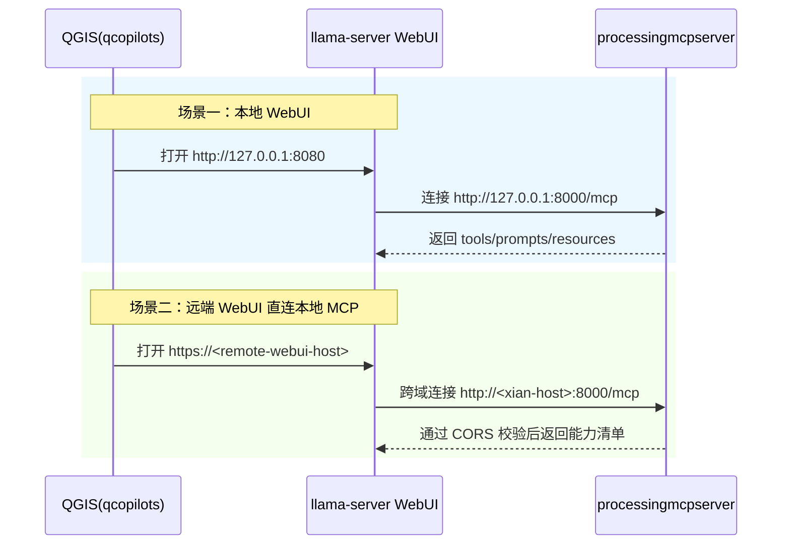

# Processing MCP Server 配置与联调说明

## 1. 适用范围

- 平台：Windows 10/11 + AMD64
- QGIS：3.44.7
- 工具链：Qt6 + VS2022（v143）
- 本文默认 `Windows + AMD64 + QGIS 3.44.7 + Qt6 + VS2022`；

## 1.1 模块职责矩阵

下表用于说明当前插件各模块的稳定职责边界：

| 模块 | 实际职责 | 命名判断 | 本轮处理 |
|---|---|---|---|
| `log_handler.py` | 统一插件日志入口与日志级别桥接 | 一致 | 保持文件名不变 |
| `config.py` / `config_models.py` / `config_loader.py` | 对外配置入口、配置模型、JSON/Settings/Default 加载与归一化 | 一致 | 保持文件名不变 |
| `server.py` | MCP Server 生命周期编排、启动/停止、tools/prompts/resources 注册 | 一致 | 保持文件名不变 |
| `transports.py` | `streamable-http` / `sse` / `stdio` 传输层封装与工厂选择 | 一致 | 保持文件名不变 |
| `mcp_main_thread_runner.py` | Qt 主线程同步执行器，供 server/tools 跨线程调用 | 一致 | 保持文件名不变 |
| `dependency_*.py` | 依赖探测、评估、契约校验、安装报告输出 | 一致 | 保持文件名不变 |
| `mcp_prompts.py` / `mcp_resources.py` | prompts/resources 注册与统一 envelope 生成 | 一致 | 保持文件名不变 |
| `plugin.py` | QGIS 插件入口、GUI 生命周期与依赖预检触发 | 一致 | 保持文件名不变 |
| `mcp_tools.py` | 工具注册与 QGIS/Processing/文件系统能力实现 | 一致 | 本轮补安全策略、返回契约和测试覆盖 |
| `tests/suite_runner.py` | 规范测试聚合入口 | 一致 | 保持 canonical 入口 |

## 2. 配置来源与优先级

当前插件使用三类配置来源，优先级顺序是 `JSON > QGIS Settings > Default`：

1. JSON 配置文件（最高优先级）。
2. QGIS Settings（次优先级）。
3. 内置默认值（最低优先级）。

## 3. 固定 JSON 路径

JSON 配置文件路径为 `<QGIS Profile>/processingmcpserver/config.json`，其中 `<QGIS Profile>` 对应 `QgsApplication.qgisSettingsDirPath()`。

若文件不存在，插件启动时会自动生成默认文件。

## 4. JSON 结构（v1）

```json
{
  "version": 1,
  "processing_mcp": {
    "enabled": true,
    "transport": "streamable-http",
    "host": "127.0.0.1",
    "port": 8000,
    "mount_path": "/",
    "sse_path": "/sse",
    "message_path": "/messages/",
    "streamable_http_path": "/mcp",
    "stateless_http": true,
    "json_response": true,
    "log_level": "INFO",
    "cors_origins": ["http://127.0.0.1:8080", "http://localhost:8080", "http://127.0.0.1:8282", "http://localhost:8282"],
    "cors_allow_headers": ["mcp-session-id", "mcp-protocol-version", "last-event-id", "authorization"],
    "enable_execute_code": false,
    "dependencies": {
      "auto_install": true
    },
    "filesystem": {
      "allowed_roots": ["<QGIS_PROFILE>/processingmcpserver", "<SYSTEM_TEMP>"],
      "readonly_roots": [],
      "disable_filesystem_tools": false
    }
  }
}
```

说明：

- `enable_execute_code` 目前仅作为兼容字段保留，当前版本不会注册任意代码执行类工具。
- 默认配置会把 `filesystem.allowed_roots` 初始化为当前 `<QGIS Profile>/processingmcpserver` 与系统临时目录；`allowed_roots` 外路径会被拒绝。
- 远端 WebUI 场景建议把 `readonly_roots` 设为 `allowed_roots` 的同一组路径，这样保留只读探查能力，同时默认关闭 `filesystem_edit_*` 写入面。

## 5. 工具阈值策略（不走配置文件）

`processing_mcp.limits.*` 已移除，工具阈值统一在 `mcp_tools.py` 内部定义默认值和保护逻辑。
README 不再固化具体上限数值，避免文档与代码常量漂移；请以 `ProcessingMCPTools` 中对应常量与归一化函数为准。

行为说明：

- `vector_get_layer_features`、`dataset_list_files`、`dataset_load_from_directory`、`processing_get_algorithms` 超限会截断并返回裁剪标记字段。

用户可在 llama-server WebUI 中通过自然语言触发带参调用（例如 `limit=42`）覆盖默认值。

## 6. MCP 能力面

当前插件对外提供三类 MCP 能力：

- `tools`：QGIS 图层/目录数据/Processing 工具调用。
- `prompts`：任务规划与图层健康检查模板（2 个）。
- `resources`：工程信息与图层摘要资源（2 个）。
- 注册清单常量：
  - `REGISTERED_TOOL_NAMES`（定义于 `mcp_tools.py`）
  - `REGISTERED_PROMPT_NAMES`（定义于 `mcp_prompts.py`）
  - `REGISTERED_RESOURCE_URIS`（定义于 `mcp_resources.py`）

### 6.0 Tools 清单（高频数据处理）

- `common_get_qgis_info`：读取 QGIS 运行环境、平台、当前项目、活跃插件与 filesystem 安全策略，用于快速定位环境问题。
- `vector_add_layer`：按路径加载单个矢量数据，可指定 provider 与图层名。
- `vector_add_layers`：批量加载多个矢量数据路径，返回成功/失败统计。
- `raster_add_layer`：按路径加载单个栅格数据，可指定 provider 与图层名。
- `raster_add_layers`：批量加载多个栅格数据路径，返回成功/失败统计。
- `layer_list`：按类型、可见性、名称模式筛选当前图层列表。
- `layer_get_panel_tree`：返回 `tree` 主结构，以及兼容旧调用的 `groups/layers` 扁平摘要，便于模型理解真实分组与顺序。
- `layer_get_details`：按图层 ID/名称读取详情（字段、几何类型、范围、CRS、数据源）。
- `layer_remove`：删除单个图层。
- `layer_remove_batch`：批量删除多个图层并返回缺失项。
- `layer_resolve_references`：把名称/ID 引用解析为唯一 layer id，返回 `resolved/missing/ambiguous`；`strict=true` 时缺失或重名都会失败。
- `vector_get_layer_features`：提取矢量图层样本要素，默认 `limit=10`，可动态覆盖。
- `vector_table_add_field`：新增字段（默认安全副本）。
- `vector_table_drop_fields`：删除字段（默认安全副本）。
- `vector_table_rename_field`：重命名字段（默认安全副本）。
- `vector_table_calculate_field`：字段计算（新增或覆盖，默认安全副本）。
- `vector_table_query_records`：记录查询（过滤/分页/排序，只读）。
- `vector_table_insert_records`：新增记录（API 兜底，默认安全副本；未知字段会写入 `warnings` 与 `outputs.ignored_fields`）。
- `vector_table_update_records`：按条件更新记录（支持常量赋值与表达式赋值，默认安全副本）。
- `vector_table_delete_records`：按条件删除记录（需 `confirm_destructive=true`）。
- `vector_table_truncate`：清空记录（需 `confirm_destructive=true`）。
- `vector_stats_basic`：矢量字段基础统计。
- `vector_stats_by_categories`：矢量分类统计。
- `raster_stats_basic`：栅格基础统计。
- `raster_stats_zonal`：分区统计（默认安全副本写入矢量统计字段）。
- `raster_stats_cell`：多栅格叠置统计。
- `dataset_list_files`：扫描目录并按数据类型、几何类型、名称模式筛选可加载数据集。
- `dataset_load_from_directory`：把目录匹配到的数据批量加载到 QGIS，并返回加载/失败统计。
- `filesystem_query_list_entries`：按目录、递归、名称模式列举文件/目录条目，仅允许访问 `allowed_roots` 内路径。
- `filesystem_query_entry_info`：查询单个路径的元信息（文件/目录、大小、时间戳等），仅允许访问 `allowed_roots` 内路径。
- `filesystem_query_read_text`：读取 UTF-8 文本文件（支持 `max_chars` 上限与截断标记），仅允许访问 `allowed_roots` 内路径。
- `filesystem_edit_write_text`：写入 UTF-8 文本（覆盖场景需要 `overwrite=true` + `confirm_destructive=true`，且目标不能命中 `readonly_roots`）。
- `filesystem_edit_append_text`：向 UTF-8 文本追加内容，且目标不能命中 `readonly_roots`。
- `filesystem_edit_copy_entry`：复制文件或目录（覆盖场景需要显式确认；source/target 都必须在 `allowed_roots` 内，target 不能命中 `readonly_roots`）。
- `filesystem_edit_move_entry`：移动/重命名文件或目录（覆盖场景需要显式确认；source/target 都必须在 `allowed_roots` 内，且都不能命中 `readonly_roots`）。
- `filesystem_edit_delete_entry`：删除文件或目录（必须 `confirm_destructive=true`，且目标不能命中 `readonly_roots`）。
- `filesystem_stats_directory`：统计目录文件数/目录数/总大小与扩展名分布，仅允许访问 `allowed_roots` 内路径。
- `processing_list_providers`：列出当前可用的 processing provider。
- `processing_get_algorithms`：查询算法列表，支持按 provider/algorithm 精确过滤并返回参数定义。
- `processing_get_parameter_template`：返回指定算法的必填/可选参数模板与输出定义。
- `processing_execute_algorithm`：执行单次 processing 算法。
- `processing_execute_on_layers`：基于 `layer_bindings` 把算法参数绑定到图层，可单次执行或批执行。

### 6.1 Prompt 清单（2 个）

- `qgis_task_planner`
- `qgis_layer_health_check`

提示模板统一结构：

- `Goal -> Inputs -> Tool Chain -> Key Params -> Validation -> Deliverables`
- 每个模板都包含中英双语关键字段，便于中文输入和英文模型理解。

### 6.2 Resource 清单（2 个）

- `qgis://project/info`
- `qgis://project/layers/summary`

Resource 统一响应 envelope：

- `generated_at`
- `project_id`
- `schema_version`
- `uri`
- `ok`
- `data` 或 `error`

### 6.3 在 llama-server WebUI 中使用 prompts/resources

1. 打开 `MCP Servers`，确认目标服务连接状态为可用。
2. 在输入框附件菜单点击 `MCP Prompt`，选择一个 prompt 并填写参数（可空）。
3. 提交后，prompt 结果会注入会话上下文，模型会按模板结构生成执行步骤。
4. 在附件菜单点击 `MCP Resources`，挂载资源（如 `qgis://project/layers/summary`）作为上下文。
5. 继续对话时要求模型“按上面 prompt + resources 调用 tools 执行”。

补充说明：

- llama-server WebUI 中看到的 tool descriptions 来自 `mcp_tools.py` 内置 tool docstring。
- WebUI 中看到的 `Server instructions` 来自 `server.py` 内置说明串。
- `Server instructions` 会明确提示三件事：先调用 `common_get_qgis_info` 建上下文、浏览器直连 MCP 时使用 `useProxy=false`、以及 `filesystem_*` 受 `allowed_roots/readonly_roots` 约束。

截图位（待补图）：

- `MCP Prompt Picker` 截图位
- `MCP Resources Browser` 截图位
- `Chat 中 prompt/resource 附件效果` 截图位

### 6.4 两个实战示例

示例一：任务规划

1. 选 `qgis_task_planner`，输入任务目标与约束。
2. 挂载 `qgis://project/info` 与 `qgis://project/layers/summary`。
3. 让模型先给出步骤分解，再调用 `processing_execute_algorithm(...)` 执行关键步骤。

示例二：图层健康检查

1. 选 `qgis_layer_health_check`，输入目标图层引用。
2. 挂载 `qgis://project/layers/summary` 作为上下文。
3. 按模板执行 `layer_get_details/vector_get_layer_features`，输出结构化检查结论。

### 6.5 常见误区

- 把 `resources` 当大数据导出接口：
  `resources` 只提供摘要/索引，大体量明细请走 `tools`（例如 `vector_get_layer_features`）。
- prompt 不写目标与约束：
  会导致步骤泛化，建议至少补充目标、输入图层、输出格式。
- 服务 capability 未启用：
  WebUI 不会显示 `MCP Prompt`/`MCP Resources` 入口。

### 6.6 属性表 CRUD 专用工具

以下工具用于“语义化直达”属性表操作，避免每次都先查算法 ID 再组装参数：

- `vector_table_add_field`：新增字段；关键输入 `field_name/field_type/field_length/field_precision`；返回 `summary.mode/affected_count/output_layer_id`。
- `vector_table_drop_fields`：删除多个字段；关键输入 `fields`；返回删除计数与 `missing_fields`。
- `vector_table_rename_field`：字段重命名；关键输入 `field_name/new_field_name`；返回重命名结果。
- `vector_table_calculate_field`：字段计算（不存在则先建字段）；关键输入 `field_name/expression/where`；返回影响记录数与是否新建字段。
- `vector_table_query_records`：记录查询；关键输入 `where/fields/limit/offset/order_by/include_geometry`；返回 `records`。
- `vector_table_insert_records`：批量新增记录；关键输入 `records`（可带 `geometry_wkt`）；返回插入计数、`warnings` 与 `outputs.ignored_fields`。
- `vector_table_update_records`：按条件更新；关键输入 `where/set_literals/set_expressions`；返回更新计数。
- `vector_table_delete_records`：按条件删除；关键输入 `where/confirm_destructive`；返回删除计数。
- `vector_table_truncate`：清空全表记录；关键输入 `confirm_destructive`；返回删除计数。

示例请求：

```json
{
  "tool": "vector_table_update_records",
  "arguments": {
    "layer_ref": "roads",
    "where": "\"class\" = 'primary'",
    "set_literals": {
      "status": "checked"
    },
    "set_expressions": {
      "score": "\"score\" + 10"
    },
    "in_place": false
  }
}
```

### 6.7 常用统计专用工具

- `vector_stats_basic`：单字段基础统计（count/min/max/sum/mean/stdev 等）。
- `vector_stats_by_categories`：按分类字段输出分组统计结果。
- `raster_stats_basic`：单栅格波段基础统计。
- `raster_stats_zonal`：矢量分区统计（将统计字段回填到矢量图层）。
- `raster_stats_cell`：多栅格像元级叠置统计。

示例请求：

```json
{
  "tool": "raster_stats_basic",
  "arguments": {
    "layer_ref": "dem",
    "band": 1
  }
}
```

### 6.8 安全写入策略

- 所有写操作默认 `in_place=false`，先创建安全副本再写入。
- 返回体统一包含 `summary.mode`：
  - `copy`：写入副本，返回 `output_layer_id` 指向新图层，源图层不变。
  - `in_place`：直接写入原图层。
- 默认副本模式下，写工具与 `raster_stats_zonal` 都保证 `output_layer_id != source_layer_id`，便于 WebUI 明确区分输出层与源图层。
- 危险删除操作必须显式确认：
  - `vector_table_delete_records(confirm_destructive=true)`
  - `vector_table_truncate(confirm_destructive=true)`
- 新增记录/更新记录支持 QGIS API 兜底，弥补 Processing 在“插入记录”上的短板。
- `processing_execute_algorithm` / `processing_execute_on_layers` 默认也启用安全策略：
  - `allow_disk_write=false`（默认）：若参数包含磁盘输出路径，自动改写为 `TEMPORARY_OUTPUT`。
  - `allow_in_place_edit=false`（默认）：自动阻止 `IN_PLACE=true` 等原地编辑参数。
  - 返回体会额外给出 `warnings`、`safety_policy`、`effective_parameters`，用于确认最终生效参数。
- `filesystem_*` 默认也启用路径沙箱：
  - `allowed_roots` 外路径一律拒绝。
  - `readonly_roots` 内仅允许查询，不允许 `filesystem_edit_*` 写操作。
  - `disable_filesystem_tools=true` 时，所有 `filesystem_*` 工具都会直接拒绝执行。
- `filesystem_edit_*` 中涉及删除/覆盖/覆盖式移动的操作都要求显式确认：
  - 删除必须 `confirm_destructive=true`
  - 覆盖复制/覆盖移动/覆盖写入必须 `overwrite=true` 且 `confirm_destructive=true`

### 6.9 算法映射表（专用工具 -> Processing/API）

| 工具名 | 主路径 | 兜底 |
|---|---|---|
| `vector_table_add_field` | QGIS API | - |
| `vector_table_drop_fields` | QGIS API | - |
| `vector_table_rename_field` | QGIS API | - |
| `vector_table_calculate_field` | QGIS API（表达式逐要素计算） | - |
| `vector_table_query_records` | QGIS API | - |
| `vector_table_insert_records` | QGIS API | - |
| `vector_table_update_records` | QGIS API | - |
| `vector_table_delete_records` | QGIS API | - |
| `vector_table_truncate` | QGIS API | - |
| `vector_stats_basic` | `native:basicstatisticsforfields` | - |
| `vector_stats_by_categories` | `qgis:statisticsbycategories` | - |
| `raster_stats_basic` | `native:rasterlayerstatistics` | - |
| `raster_stats_zonal` | `native:zonalstatisticsfb` | - |
| `raster_stats_cell` | `native:cellstatistics` | - |

### 6.10 `filesystem_*` 与 `dataset_*` 的边界

| 维度 | `dataset_*` | `filesystem_*` |
|---|---|---|
| 目标 | GIS 数据集识别与入图 | 通用文件系统查询/编辑/统计 |
| 输入对象 | 矢量/栅格候选文件 | 任意文件或目录 |
| 输出重点 | 数据集类型、几何类型、加载结果 | 路径元信息、文本内容、复制/移动/删除结果 |
| 是否负责加载到 QGIS | 是（`dataset_load_from_directory`） | 否 |
| 典型用途 | 批量发现并加载 shp/gpkg/tif | 管理 allowlist 内的配置、日志、脚本、临时文件 |

选择建议：

- 需要“识别 GIS 数据并加载到图层面板”时，使用 `dataset_*`。
- 需要“读写普通文件/目录”时，使用 `filesystem_*`。

### 6.11 最小 JSON 调用示例

`common_get_qgis_info`：

```json
{
  "tool": "common_get_qgis_info",
  "arguments": {}
}
```

`processing_execute_algorithm`（默认安全模式，磁盘输出会被改写为临时输出）：

```json
{
  "tool": "processing_execute_algorithm",
  "arguments": {
    "algorithm": "native:buffer",
    "parameters": {
      "INPUT": "roads",
      "DISTANCE": 50,
      "OUTPUT": "C:/temp/buffer.gpkg"
    },
    "load_results": true
  }
}
```

`processing_execute_algorithm`（显式允许写盘与原地编辑）：

```json
{
  "tool": "processing_execute_algorithm",
  "arguments": {
    "algorithm": "native:buffer",
    "parameters": {
      "INPUT": "roads",
      "DISTANCE": 50,
      "OUTPUT": "C:/temp/buffer.gpkg",
      "IN_PLACE": true
    },
    "load_results": false,
    "allow_disk_write": true,
    "allow_in_place_edit": true
  }
}
```

`filesystem_query_list_entries`：

```json
{
  "tool": "filesystem_query_list_entries",
  "arguments": {
    "directory": "<QGIS_PROFILE>/processingmcpserver",
    "recursive": true,
    "name_glob": "*.py",
    "limit": 200
  }
}
```

`filesystem_edit_delete_entry`（破坏性动作必须确认）：

```json
{
  "tool": "filesystem_edit_delete_entry",
  "arguments": {
    "path": "C:/temp/to-delete.txt",
    "confirm_destructive": true
  }
}
```

## 7. 依赖预检与自动安装

- 启动时会读取插件目录 `requirements.txt` 作为唯一依赖来源。
- `requirements.txt` 使用区间版本约束（`>=,<`），便于开发者升级与回归。
- 当前建议区间：
  - `mcp>=1.13.0,<2.0.0`
  - `uvicorn>=0.31.1,<1.0.0`
  - `starlette>=0.27,<1.0.0`
- 若存在缺失且 `dependencies.auto_install=true`，会在当前运行环境中解析目标解释器并执行安装。
- 解释器解析顺序固定为：`sys.executable(仅当文件名为 python*)` -> `sys.prefix/python(.exe)` -> `sys.exec_prefix/python(.exe)` -> `sys.base_prefix/python(.exe)`。
- 安装命令固定为 `<resolved_python> -m pip install ...`，不会回退到 `--user` 目录。
- 若目标 Python 根环境不可写（如权限不足），安装会失败并给出明确错误，不会自动回退到用户目录。
- 依赖检查与安装报告写入 `<QGIS Profile>/processingmcpserver/dependency-report.json`。
- 依赖满足后会执行 FastMCP 运行时契约校验，要求：
  - `FastMCP.__init__` 支持当前插件使用的参数（`host/port/mount_path/sse_path/message_path/streamable_http_path/stateless_http/json_response/log_level`）。
  - `FastMCP` 提供可调用的 `streamable_http_app` 与 `sse_app`。
- 契约校验失败会写入 `failure_reason` 并阻止插件启动。

### 报告生成链路

- `plugin.initGui`（`plugin.py`）
- `ensure_processing_mcp_dependencies`（`dependency_manager.py`）
- `_write_dependency_report`（`dependency_reporting.py`）

依赖模块分工：

- `dependency_manager.py`：依赖检查主编排与对外入口。
- `dependency_models.py`：依赖检查相关 dataclass 模型。
- `dependency_probe.py`：环境采集、pip 探测、requirements 读取。
- `dependency_evaluator.py`：requirement 解析与满足性评估。
- `dependency_contract.py`：FastMCP 运行时契约校验。
- `dependency_reporting.py`：依赖报告输出与日志摘要。
- `mcp_main_thread_runner.py`：Qt 主线程同步执行器（供 `server.py`/`mcp_tools.py` 使用）。

说明：

- 依赖预检阶段只读取 `dependencies.auto_install`；其它配置字段不会参与依赖安装决策。
- `dependency-report.json` 是运行时代码生成，不是配置文件“创建”。

报告关键字段（schema v3）：

- `report_schema_version`
- `platform_system` / `platform_release` / `platform_machine`
- `python_executable` / `python_version`
- `python_prefix` / `python_base_prefix` / `python_exec_prefix`
- `is_virtual_environment`
- `site_packages` / `user_site_packages`
- `pip_available` / `pip_version` / `pip_error`
- `pip_python_executable` / `pip_python_source`
- `pip_probe_command` / `pip_probe_stdout` / `pip_probe_stderr`
- `requirements_file_path` / `requirements_file_read` / `requirements_file_error`
- `install_target_prefix` / `install_target_site_packages`
- `mcp_runtime_contract_ok` / `mcp_runtime_contract_error`
- `requested_requirements`
- `unsatisfied_before` / `unsatisfied_after`
- `unsatisfied_reasons_before` / `unsatisfied_reasons_after`
- `installed_versions_before` / `installed_versions_after`
- `install_command`
- `failure_reason`

### 7.1 日志页签与级别

- 所有插件日志写入 QGIS `Log Messages` 面板的 `Processing MCP Server` 页签。
- 默认 `log_level=INFO`，日常联调可直接使用。
- 需要更细粒度诊断时可改为 `DEBUG`，会看到更多 `uvicorn/mcp/starlette` 桥接日志。

## 8. QGIS Settings 回退键

当 JSON 未提供某个键时，会回退读取 `Processing/MCP/*`：

- `Processing/MCP/enabled`
- `Processing/MCP/transport`
- `Processing/MCP/host`
- `Processing/MCP/port`
- `Processing/MCP/mount_path`
- `Processing/MCP/sse_path`
- `Processing/MCP/message_path`
- `Processing/MCP/streamable_http_path`
- `Processing/MCP/stateless_http`
- `Processing/MCP/json_response`
- `Processing/MCP/log_level`
- `Processing/MCP/cors_origins`
- `Processing/MCP/cors_allow_headers`
- `Processing/MCP/enable_execute_code`
- `Processing/MCP/dependencies/auto_install`
- `Processing/MCP/filesystem/allowed_roots`
- `Processing/MCP/filesystem/readonly_roots`
- `Processing/MCP/filesystem/disable_filesystem_tools`

## 9. 架构图

### 9.1 组件架构图


### 9.2 场景时序图（场景一 + 场景二）



## 10. 场景一：本地 WebUI 联调步骤

1. 本地启动 `llama-server` 并启用 WebUI（默认 `http://127.0.0.1:8080`）。
2. 打开 QGIS，确认 `processingmcpserver` 已加载并监听 `http://127.0.0.1:8000/mcp`。
3. 在 `qcopilots` Dock 打开 `http://127.0.0.1:8080`。
4. 在 WebUI 的 MCP 设置中新增服务：
   - URL：`http://127.0.0.1:8000/mcp`
   - `useProxy=false`
5. 按以下清单做严格验收：
   - `MCP Server` 卡片中必须能看到中文 tool descriptions，且 `Server instructions` 可展开查看。
   - `listPrompts` 返回数量必须为 `2`，且仅包含 `qgis_task_planner`、`qgis_layer_health_check`。
   - `listResources` 返回数量必须为 `2`，且仅包含 `qgis://project/info`、`qgis://project/layers/summary`。
   - `listTools` 必须包含 `processing_execute_algorithm`、`layer_get_details`、`vector_get_layer_features`、`vector_table_query_records`、`vector_table_update_records`、`vector_stats_basic`、`raster_stats_basic`，且不包含已移除旧名（如 `execute_processing`、`render_map`）。
   - 最少完成 1 次工具调用并成功（建议先 `common_get_qgis_info`，再 `layer_list` 复核）。

## 11. 场景二：远端 WebUI 直连本地 MCP

0. 先确认 WebUI 的真实源（不是猜测）：
   - 在 MCP 页开发者工具执行 `window.location.origin`。
   - 常见输出：`http://localhost:8282`（SSH 端口转发）或 `https://<remote-webui-host>`（直连远端域名）。
1. 在北京服务器启动 llama-server WebUI（例如 `https://<remote-webui-host>`）。
2. 在西安本机启动 QGIS 与 `processingmcpserver`。
3. 在本机配置 `processing_mcp.cors_origins`，放行上一步确认到的真实源（精确到协议+域名+端口）。
4. 在 WebUI 里配置 MCP Server：
   - URL：`http://127.0.0.1:8000/mcp`（SSH 隧道场景常用）或 `http://<xian-host>:8000/mcp`
   - `Use llama-server proxy`：关闭（`useProxy=false`）
5. 在西安本机执行 CORS 预检（示例为 SSH 隧道来源）：

```bash
curl -i -X OPTIONS http://127.0.0.1:8000/mcp \
  -H "Origin: http://localhost:8282" \
  -H "Access-Control-Request-Method: POST" \
  -H "Access-Control-Request-Headers: mcp-session-id,mcp-protocol-version"
```

期望结果：

- 状态码为 `2xx`。
- 响应头包含 `Access-Control-Allow-Origin: http://localhost:8282`。
- 响应头包含 `Access-Control-Allow-Headers` 且覆盖 `mcp-session-id,mcp-protocol-version`。

6. 在 WebUI MCP 面板点击重连，按以下清单做严格验收：
   - 连接日志从 `Sending initialize request...` 进入成功阶段（如 capability 交换/connected），不再出现 `Failed to fetch`。
   - `MCP Server` 卡片中必须能看到中文 tool descriptions，且 `Server instructions` 可展开查看。
   - `listPrompts` 返回数量必须为 `2`，且仅包含 `qgis_task_planner`、`qgis_layer_health_check`。
   - `listResources` 返回数量必须为 `2`，且仅包含 `qgis://project/info`、`qgis://project/layers/summary`。
   - `listTools` 必须包含 `processing_execute_algorithm`、`layer_get_details`、`vector_get_layer_features`、`vector_table_query_records`、`vector_table_update_records`、`vector_stats_basic`、`raster_stats_basic`，且不包含已移除旧名（如 `execute_processing`、`render_map`）。
   - 最少完成 1 次工具调用（建议 `common_get_qgis_info`）并在 MCP 面板看到成功返回。

### 11.1 场景二配置模板

- SSH 端口转发场景（`window.location.origin` 为 `http://localhost:8282`）：
  `examples/config.scene2.ssh-tunnel.v1.json`
- 远端 HTTPS 直连场景（`window.location.origin` 为 `https://<remote-webui-host>`）：
  `examples/config.scene2.remote-https.v1.json`

注意：

- 该路径是“远端 WebUI 直连本地 MCP”，主路径不依赖 `--webui-mcp-proxy`。
- `useProxy=false` 时，`127.0.0.1` 由浏览器所在机器解释。若你用 `http://localhost:8282`（SSH 转发）访问 WebUI，`127.0.0.1:8000` 指向西安本机。
- `useProxy=true` 时，请求改由 llama-server 进程发起，`127.0.0.1` 会变成远端 Ubuntu 本机回环地址，通常不符合本场景目标。
- 若网络拓扑不可达，需要先打通路由/NAT/防火墙。

## 12. 故障排查

- `config.json` 语法错误：插件会记录 warning，并回退到 Settings/默认值。
- 配置值非法（如端口越界）：该键降级到低优先级来源并记录 warning。
- 场景二跨域失败：优先检查 `cors_origins` 是否包含远端源。
- 地址不可达：检查防火墙、端口暴露、NAT 映射是否正确。
- 错误使用 `useProxy`：远端直连本地 MCP 场景应使用 `useProxy=false`。
- MCP 卡片出现 `Failed to fetch` 且日志停在 `Sending initialize request...`：优先排查 CORS（看 `window.location.origin` 与 `cors_origins` 是否严格匹配）。
- llama-server 日志出现 `proxying GET ... google.com/s2/favicons?...`：这是 favicon 拉取请求，不等价于 MCP initialize 失败根因。
- 依赖自动安装失败：查看 `dependency-report.json` 的 `pip_error`、`install_return_code`、`failure_reason`、`install_stdout`、`install_stderr`。

### 12.1 MetaSearch / jinja2 全局修复（独立于 processingmcpserver）

说明：

- `MetaSearch` 对 `jinja2` 的依赖属于 QGIS 插件全局运行时问题，不在 `processingmcpserver` 自动依赖管理范围内。
- 请使用对应安装目录下的 `python.exe` 执行安装，确保安装到目标 Python 根环境。

示例 A（`E:\osgeo4w-setup\OSGeo4W34407`）：

```powershell
E:\osgeo4w-setup\OSGeo4W34407\apps\Python312\python.exe -m pip install --disable-pip-version-check --no-input "jinja2>=3.1,<4.0"
E:\osgeo4w-setup\OSGeo4W34407\apps\Python312\python.exe -c "import jinja2,markupsafe;print(jinja2.__version__);print(markupsafe.__version__)"
```

示例 B（`I:\data\QGISInstall\qgis34407`）：

```powershell
I:\data\QGISInstall\qgis34407\apps\Python312\python.exe -m pip install --disable-pip-version-check --no-input "jinja2>=3.1,<4.0"
I:\data\QGISInstall\qgis34407\apps\Python312\python.exe -c "import jinja2,markupsafe;print(jinja2.__version__);print(markupsafe.__version__)"
```

回滚（按需）：

```powershell
<QGIS_PYTHON_EXE> -m pip uninstall -y jinja2 markupsafe
```

## 13. 在 QGIS Python Console 运行测试

可直接在 QGIS Python Console 执行：

```python
from processingmcpserver.tests.suite_runner import run_from_qgis_console
run_from_qgis_console(verbosity=2)
```

说明：

- 该入口会先检测 `QgsApplication.instance()`，避免重复初始化冲突。
- 失败堆栈会直接回显到 QGIS Python Console，便于联调。
- 工具测试使用固定样本目录：`python/plugins/processingmcpserver/tests/data`。

### 13.1 通过命令行运行全量单测（PowerShell）

不启动 QGIS GUI、直接命令行运行测试时，可在 `PowerShell` 执行：

```powershell
$env:PYTHONHOME='<OSGEO4W_ROOT>\apps\Python312'; `
$env:QGIS_PREFIX_PATH='<QGIS_BUILD_DIR>\output\bin\<BUILD_CONFIG>'; `
$env:PATH='<QGIS_BUILD_DIR>\output\bin\<BUILD_CONFIG>;<OSGEO4W_ROOT>\apps\Qt6\bin;<OSGEO4W_ROOT>\bin;' + $env:PATH; `
$env:PYTHONPATH='<QGIS_SOURCE_DIR>\python\plugins;<QGIS_BUILD_DIR>\output\python;<QGIS_BUILD_DIR>\output\python\plugins;<QGIS_SOURCE_DIR>\tests\src\python'; `
<OSGEO4W_ROOT>\apps\Python312\python.exe -B -m processingmcpserver.tests.suite_runner
```

占位符说明：

- `<OSGEO4W_ROOT>`：OSGeo4W 根目录（例如 `C:\OSGeo4W`）。
- `<QGIS_SOURCE_DIR>`：QGIS 源码根目录（例如 `C:\OSGeo4W64\QGIS`）。
- `<QGIS_BUILD_DIR>`：QGIS 构建目录（例如 `I:\QGISCompilations\VisualStudio2022\feature-final-3_44_7-mcp\qgis-project`）。
- `<BUILD_CONFIG>`：构建配置（常见值：`RelWithDebInfo`、`Release`、`Debug`）。

说明：

- 上述命令是 PowerShell 语法（`$env:...`），不适用于 `cmd`。
- 该方式用于“命令行直接跑测试”；QGIS Python Console 方式仍适用于交互调试。
- 若环境中 Processing 算法提供者未完整可用，部分用例可能因 `Algorithm not found` 失败。

### 13.2 tests/data 固化测试数据

- 当前目录至少包含：
  - `dem.tif`（栅格测试样本）
  - `sample_vector.geojson`（矢量测试样本）
- 为保证 source/output 行为一致，`tests/CMakeLists.txt` 已安装 `tests/data/*` 到插件测试目录。

安装后可在 output 目录检查：

```bat
dir <QGIS_BUILD_DIR>\output\python\plugins\processingmcpserver\tests\data
```

校验点：

- 必须能看到 `dem.tif` 与 `sample_vector.geojson`。
- 若缺失，先执行构建/安装同步，再从 QGIS Python Console 重跑测试。

## 14. 语法校验命令详解（Qt6 主链路）

你给出的命令：

```bat
cmd /c "call C:\OSGeo4W64\bin\o4w_env.bat && call C:\OSGeo4W64\bin\py3_env.bat && python -m py_compile ..."
```

命令结构说明：

- `cmd /c`：在独立 CMD 会话执行整串命令并退出。
- `call ...\o4w_env.bat`：初始化 OSGeo4W 基础环境变量（PATH/GDAL/PROJ 等）。
- `call ...\py3_env.bat` 或 `call ...\python3.bat`：绑定 Python 解释器路径。
- `python -m py_compile`：仅做 Python 语法编译检查，不运行业务逻辑。

为什么该命令不适用于 Qt6 主链路：

- `C:\OSGeo4W64\bin\py3_env.bat` 绑定的是 `Python39 + Qt5` 套件。
- Qt6 主链路应使用 `C:\OSGeo4W` 套件，并显式切换到 Qt6 环境。
- 结论：`C:\OSGeo4W64\bin\py3_env.bat` 不作为 Qt6 主链路命令模板。

Qt6 推荐命令（Windows 10/11 + AMD64）：

```bat
cmd /c "call C:\OSGeo4W\bin\o4w_env.bat && call C:\OSGeo4W\etc\ini\python3.bat && call C:\OSGeo4W\bin\qt6_env.bat && python -m py_compile C:\OSGeo4W64\QGIS\python\plugins\processingmcpserver\mcp_tools.py C:\OSGeo4W64\QGIS\python\plugins\processingmcpserver\mcp_prompts.py C:\OSGeo4W64\QGIS\python\plugins\processingmcpserver\mcp_resources.py C:\OSGeo4W64\QGIS\python\plugins\processingmcpserver\dependency_manager.py C:\OSGeo4W64\QGIS\python\plugins\processingmcpserver\dependency_models.py C:\OSGeo4W64\QGIS\python\plugins\processingmcpserver\dependency_probe.py C:\OSGeo4W64\QGIS\python\plugins\processingmcpserver\dependency_evaluator.py C:\OSGeo4W64\QGIS\python\plugins\processingmcpserver\dependency_contract.py C:\OSGeo4W64\QGIS\python\plugins\processingmcpserver\dependency_reporting.py C:\OSGeo4W64\QGIS\python\plugins\processingmcpserver\mcp_main_thread_runner.py C:\OSGeo4W64\QGIS\python\plugins\processingmcpserver\tests\suite_runner.py"
```

或直接对 tests 目录做整体验证：

```bat
cmd /c "call C:\OSGeo4W\bin\o4w_env.bat && call C:\OSGeo4W\etc\ini\python3.bat && call C:\OSGeo4W\bin\qt6_env.bat && python -m compileall C:\OSGeo4W64\QGIS\python\plugins\processingmcpserver\tests"
```

环境校验命令（建议紧接着执行）：

```bat
call C:\OSGeo4W\bin\o4w_env.bat
call C:\OSGeo4W\etc\ini\python3.bat
call C:\OSGeo4W\bin\qt6_env.bat
python -c "import os,sys;print(sys.executable);print(sys.version);print(os.environ.get('PYTHONHOME',''));print(os.environ.get('PATH','').split(';')[0])"
```

校验点：

- `sys.executable` 应来自目标环境的 `...\apps\Python312\python.exe`（例如 `E:\osgeo4w-setup\OSGeo4W34407\apps\Python312\python.exe`）。
- `sys.version` 应为 `3.12.x`。
- PATH 前部应包含 `Qt6\bin`。

副作用与清理：

- `py_compile` 或 `compileall` 会生成 `__pycache__`。
- 清理命令：

```bat
for /r C:\OSGeo4W64\QGIS\python\plugins\processingmcpserver %d in (__pycache__) do @if exist "%d" rd /s /q "%d"
```

## 15. Markdown 渲染差异说明（llama-server WebUI）

- `> **使用示例**` 这类写法在 llama-server WebUI 中会按 `blockquote` 样式渲染，视觉上会出现大引号和斜体倾向。
- 这不是 Markdown 不支持，而是 WebUI 样式与 VSCode 主题实现差异。
- 规避建议：把标题容器改为 `## 使用示例` 或普通 `**使用示例**`，避免 `blockquote` 触发样式。

## 16. llama.cpp Markdown 渲染 Trade-off 调研结论

结论：

- 当前未发现官方将 `blockquote` 视觉样式定义为缺陷并修复的 issue/PR 结论。
- 官方近期 WebUI 演进更偏向“可读性与交互体验增强”，而不是“严格复刻 VSCode 样式”。
- 因此 `> **使用示例**` 的视觉差异属于样式策略差异，不是 Markdown 语法不支持。

官方讨论体现的取舍方向：

- 安全与一致性：对 Markdown 中原始 HTML 的处理采取更谨慎策略（例如 literal-html 相关改动）。
- 渲染保真度：针对表格、LaTeX、代码块等逐步补齐可读性与保真度。
- 性能与交互：流式渲染性能优化、选择文本体验优化优先级较高。

参考：

- https://github.com/ggml-org/llama.cpp/issues/17462
- https://github.com/ggml-org/llama.cpp/pull/17477
- https://github.com/ggml-org/llama.cpp/pull/16505
- https://github.com/ggml-org/llama.cpp/issues/16228
- https://github.com/ggml-org/llama.cpp/pull/16358
- https://github.com/ggml-org/llama.cpp/pull/19551
