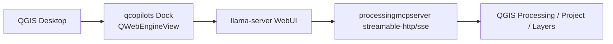
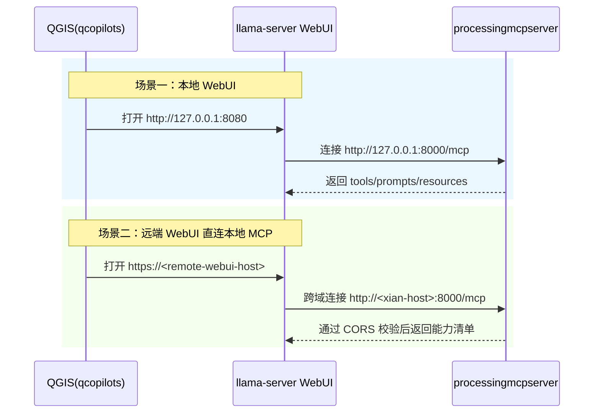

## 1. 环境说明

- 操作系统：Windows 10/11
- 指令集架构：AMD64
- QGIS 版本：3.44.7
- 工具链：CMake + cygwin + visual studio 2022

## 2. 配置说明

### 2.1 配置来源与优先级

当前插件使用下列三类配置来源，优先级顺序是 JSON > QGIS Settings > Default 次序：

- 最高优先级：JSON 配置文件
- 次优先级：QGIS Settings
- 最低优先级：内置默认值

> [!NOTE]
> 1. JSON 配置文件路径为 <QGIS Profile>/processingmcpserver/config.json ，其中 <QGIS Profile> 对应 `QgsApplication.qgisSettingsDirPath()` 返回路径，若文件不存在，插件启动时会自动生成默认文件。

### 2.2 配置文件结构

```json
{
  "version": 1,
  "processing_mcp": {
    "enabled": true,
    "transport": "streamable-http",
    "host": "127.0.0.1",
    "port": 8000,
    "mount_path": "/",
    "sse_path": "/sse",
    "message_path": "/messages/",
    "streamable_http_path": "/mcp",
    "stateless_http": true,
    "json_response": true,
    "log_level": "INFO",
    "cors_origins": [
      "http://127.0.0.1:8080",
      "http://localhost:8080",
      "http://127.0.0.1:8282",
      "http://localhost:8282"],
    "cors_allow_headers": [
      "mcp-session-id",
      "mcp-protocol-version",
      "last-event-id",
      "authorization"],
    "enable_execute_code": false,
    "dependencies": {
      "auto_install": true
    }
  }
}
```

> [!NOTE]
> 1. `enable_execute_code` 目前仅作为兼容字段保留，当前版本不会注册任意代码执行类工具。
> 2. `filesystem_query_*` 与 `filesystem_stats_directory` 为只读能力，不再依赖白名单配置。
> 3. `filesystem_edit_*` 默认拒绝写入，必须显式传入 `confirm_write=true`；删除与覆盖操作还需 `confirm_destructive=true`。

## 3. 依赖预检与自动安装

- 启动时会读取插件目录 requirements.txt 作为唯一依赖来源。
- 若存在缺失且 dependencies.auto_install=true，会在当前运行环境中解析目标解释器并执行安装,解释器解析顺序固定为:
  - `sys.executable(仅当文件名为 python*)`
  - `sys.prefix/python(.exe)`
  - `sys.exec_prefix/python(.exe)`
  - `sys.base_prefix/python(.exe)`
- 安装命令固定为 `<resolved_python> -m pip install ...`，不会回退到 --user 目录。若目标 Python 根环境不可写（如权限不足），安装会失败并给出明确错误，不会自动回退到用户目录。
- 依赖检查与安装报告写入 <QGIS Profile>/processingmcpserver/dependency-report.json 文件中。

## 4. 日志页签与级别

所有插件日志写入 QGIS Log Messages 面板的 Processing MCP Server 页签，默认为 log_level=INFO 设置，日常联调可直接使用，需要更细粒度诊断时可改为 DEBUG 设置，会看到更多 uvicorn/mcp/starlette 桥接日志。

## 5. QGIS Settings 回退键

当 JSON 未提供某个键时，会回退读取 `Processing/MCP/*`：

- `Processing/MCP/enabled`
- `Processing/MCP/transport`
- `Processing/MCP/host`
- `Processing/MCP/port`
- `Processing/MCP/mount_path`
- `Processing/MCP/sse_path`
- `Processing/MCP/message_path`
- `Processing/MCP/streamable_http_path`
- `Processing/MCP/stateless_http`
- `Processing/MCP/json_response`
- `Processing/MCP/log_level`
- `Processing/MCP/cors_origins`
- `Processing/MCP/cors_allow_headers`
- `Processing/MCP/enable_execute_code`
- `Processing/MCP/dependencies/auto_install`

## 6. 架构图

### 6.1 组件架构图



### 6.2 场景时序图



## 7. QGIS Python Console

### 7.1 生成 MCP 能力文档

```python
# 先确认当前 QGIS 运行的是哪一份插件代码
import processingmcpserver
print(processingmcpserver.__file__)

# 使用默认输出路径导出能力文档
output_path = processingmcpserver.write_mcp_capabilities_markdown()
print(output_path)

# 使用显式路径导出能力文档
from pathlib import Path
output_path = processingmcpserver.write_mcp_capabilities_markdown(
  Path(r"I:\github_repos\QGIS\python\plugins\processingmcpserver\MCP_CAPABILITIES.generated.md")
)
print(output_path)
```

### 7.2 在 QGIS Python Console 中运行测试

```python
# 可直接在 QGIS Python Console 执行
from processingmcpserver.tests.suite_runner import run_from_qgis_console
run_from_qgis_console(verbosity=2)
```

该入口会先检测 `QgsApplication.instance()`，避免重复初始化冲突。失败堆栈会直接回显到 QGIS Python Console，便于联调。工具测试使用固定样本目录，即 `python/plugins/processingmcpserver/tests/data` 目录。

### 7.3 通过命令行运行全量单测

```powershell
# 不启动 QGIS GUI、直接命令行运行测试
$env:PYTHONHOME='<OSGEO4W_ROOT>\apps\Python312'; `
$env:QGIS_PREFIX_PATH='<QGIS_BUILD_DIR>\output\bin\<BUILD_CONFIG>'; `
$env:PATH='<QGIS_BUILD_DIR>\output\bin\<BUILD_CONFIG>;<OSGEO4W_ROOT>\apps\Qt6\bin;<OSGEO4W_ROOT>\bin;' + $env:PATH; `
$env:PYTHONPATH='<QGIS_SOURCE_DIR>\python\plugins;<QGIS_BUILD_DIR>\output\python;<QGIS_BUILD_DIR>\output\python\plugins;<QGIS_SOURCE_DIR>\tests\src\python'; `
<OSGEO4W_ROOT>\apps\Python312\python.exe -B -m processingmcpserver.tests.suite_runner
```

占位符说明：

- <OSGEO4W_ROOT>：OSGeo4W 根目录。
- <QGIS_SOURCE_DIR>：QGIS 源码根目录。
- <QGIS_BUILD_DIR>：QGIS 构建目录。
- <BUILD_CONFIG>：构建配置，例如 RelWithDebInfo 配置。

> [!NOTE]
> 1. 上述命令是 PowerShell 语法（`$env:...`），不适用于 `cmd`。
> 2. 该方式用于命令行直接跑测试，QGIS Python Console 方式仍适用于交互调试。

## 8. 语法校验命令详解

**一、对功能做验证**

```bat
cmd /c "call C:\OSGeo4W\bin\o4w_env.bat && call C:\OSGeo4W\etc\ini\python3.bat && call C:\OSGeo4W\bin\qt6_env.bat && python -m py_compile C:\OSGeo4W64\QGIS\python\plugins\processingmcpserver\mcp_tools.py C:\OSGeo4W64\QGIS\python\plugins\processingmcpserver\mcp_prompts.py C:\OSGeo4W64\QGIS\python\plugins\processingmcpserver\mcp_resources.py C:\OSGeo4W64\QGIS\python\plugins\processingmcpserver\dependency_manager.py C:\OSGeo4W64\QGIS\python\plugins\processingmcpserver\dependency_models.py C:\OSGeo4W64\QGIS\python\plugins\processingmcpserver\dependency_probe.py C:\OSGeo4W64\QGIS\python\plugins\processingmcpserver\dependency_evaluator.py C:\OSGeo4W64\QGIS\python\plugins\processingmcpserver\dependency_contract.py C:\OSGeo4W64\QGIS\python\plugins\processingmcpserver\dependency_reporting.py C:\OSGeo4W64\QGIS\python\plugins\processingmcpserver\mcp_main_thread_runner.py C:\OSGeo4W64\QGIS\python\plugins\processingmcpserver\tests\suite_runner.py"
```

**二、对测试做整体验证**

```bat
cmd /c "call C:\OSGeo4W\bin\o4w_env.bat && call C:\OSGeo4W\etc\ini\python3.bat && call C:\OSGeo4W\bin\qt6_env.bat && python -m compileall C:\OSGeo4W64\QGIS\python\plugins\processingmcpserver\tests"
```

**三、对环境做验证**

```bat
call C:\OSGeo4W\bin\o4w_env.bat
call C:\OSGeo4W\etc\ini\python3.bat
call C:\OSGeo4W\bin\qt6_env.bat
python -c "import os,sys;print(sys.executable);print(sys.version);print(os.environ.get('PYTHONHOME',''));print(os.environ.get('PATH','').split(';')[0])"
```

## 9. 故障排查

- 配置文件语法错误：插件会记录 warning，并回退到 Settings/Default 设置。
- 配置文件中的配置值非法：如端口越界，该键降级到低优先级来源并记录 warning。
- 跨域失败：优先检查 `cors_origins` 是否包含远端源。
- 地址不可达：检查防火墙、端口暴露、NAT 映射是否正确。
- 错误使用 useProxy 配置：远端直连本地 MCP 场景应使用 `useProxy=false`。
